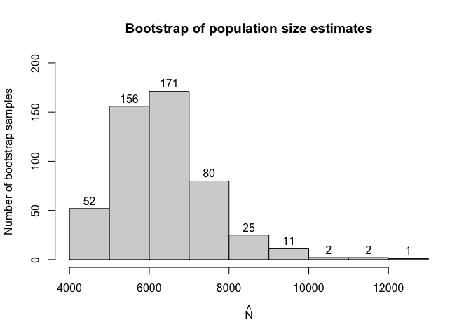

<!-- README.md is generated from README.Rmd. Please edit that file -->

# Overview

<!-- badges: start -->

[](https://github.com/ncn-foreigners/singleRcapture/actions)
[](https://app.codecov.io/gh/ncn-foreigners/singleRcapture?branch=main)
<!-- badges: end -->

Capture-recapture type experiments are used to estimate the total
population size in situations when observing only a part of such
population is feasible. In recent years these types of experiments have
seen more interest.

Single source models are distinct from other capture-recapture models
because we cannot estimate the population size based on how many units
were observed in two or three sources which is the standard approach.

Instead in single source models we utilise count data regression models
on positive distributions (i.e. on counts greater than 0) where the
dependent variable is the number of times a particular unit was observed
in source data.

This package aims to implement already existing and introduce new
methods of estimating population size from single source to simplify the
research process.

Currently we’ve implemented most of the frequentist approaches used in
literature such as:

- Zero truncated poisson, geometric and negative binomial regression.
- Zero truncated one inflated and one inflated zero truncated poisson
  and gemetric models. (Negative binomial is currently in development.)
- Zero one truncated poisson geometric and negative binomial models.
- Generalised Chao and Zelterman’s models based on logistic regression.
- Three types of bootstrap parametric, semi-parametric and non
  parametric.
- And a wide range of additional functionalities associated with
  (vector) generalised linear models relevant to the topic.

## Installation

You can install the development version of singleRcapture from
[GitHub](https://github.com/ncn-foreigners/singleRcapture) with:

``` r
# install.packages("devtools")
remotes::install_github("ncn-foreigners/singleRcapture")
```

### Examples

The main function of this package is `estimatePopsize` which fitts
regression on specified distribution and then uses fitted regression to
estimate the population size.

Lets look at a model from 2003 publication : Point and interval
estimation of the population size using the truncated Poisson regression
model Heijden, Peter GM van der et al. The call to `estimatePopsize`
will look very simmilar to anyone who used the `stats::glm` function:

``` r
library(singleRcapture)
model <- estimatePopsize(
  formula = capture ~ gender + age + nation, # specify formula
  data = netherlandsimmigrant,
  popVar = "analytic", # specify 
  model = "ztpoisson", # distribution used
  method = "IRLS", # fitting method one of three currently supported
  controlMethod = controlMethod(silent = TRUE) # ignore convergence at half step warning
)
summary(model) # a summary method for singleR class with standard glm-like output and population size estimation resutls
#> 
#> Call:
#> estimatePopsize(formula = capture ~ gender + age + nation, data = netherlandsimmigrant, 
#>     model = "ztpoisson", method = "IRLS", popVar = "analytic", 
#>     controlMethod = controlMethod(silent = TRUE))
#> 
#> Pearson Residuals:
#>      Min.   1st Qu.    Median      Mean   3rd Qu.      Max. 
#> -0.486442 -0.486442 -0.298080  0.002093 -0.209444 13.910844 
#> 
#> Coefficients:
#> -----------------------
#> For linear predictors associated with: lambda 
#>                      Estimate Std. Error z value  P(>|z|)    
#> (Intercept)           -1.3411     0.2149  -6.241 4.35e-10 ***
#> gendermale             0.3972     0.1630   2.436 0.014832 *  
#> age>40yrs             -0.9746     0.4082  -2.387 0.016972 *  
#> nationAsia            -1.0926     0.3016  -3.622 0.000292 ***
#> nationNorth Africa     0.1900     0.1940   0.979 0.327398    
#> nationRest of Africa  -0.9106     0.3008  -3.027 0.002468 ** 
#> nationSurinam         -2.3364     1.0136  -2.305 0.021159 *  
#> nationTurkey          -1.6754     0.6028  -2.779 0.005445 ** 
#> ---
#> Signif. codes:  0 '***' 0.001 '**' 0.01 '*' 0.05 '.' 0.1 ' ' 1
#> 
#> AIC: 1712.901
#> BIC: 1757.213
#> Residual deviance: 1128.553
#> 
#> Log-likelihood: -848.4504 on 1872 Degrees of freedom 
#> Number of iterations: 8
#> -----------------------
#> Population size estimation results: 
#> Point estimate 12690.35
#> Observed proportion: 14.8% (N obs = 1880)
#> Std. Error 2808.167
#> 95% CI for the population size:
#>           lowerBound upperBound
#> normal      7186.446   18194.26
#> logNormal   8431.276   19718.31
#> 95% CI for the share of observed population:
#>           lowerBound upperBound
#> normal     10.332930   26.16036
#> logNormal   9.534284   22.29793
```

We implemented a method for `plot` function to visualise the model fit
and other usefull diagnostic information. One of which is `rootogram`, a
type of plot that compares fitted and observed marginal frequencies:

``` r
plot(model, plotType = "rootogram")
```


The possible values for `plotType` argument are:

- `qq` - the normal quantile-quantile plot for pearson residuals.
- `marginal` - a `matplot` comparing fitted and observed marginal
  frequencies.
- `fitresid` - plot of linear predictor values contrasted with pearson
  residuals.
- `bootHist` - histogram of bootstrap sample.
- `rootogram` - rootogram, example presented above.
- `dfpopContr` - contrasting two deletion effects to identify presence
  of influential observations.
- `dfpopBox` - boxplot of results from dfpopsize function see its
  documentation.
- `scaleLoc` - scale-location plot.
- `cooks` - plot of `cooks.values` for distributions for which it is
  defined.
- `hatplot` - plot of `hatvalues`.
- `strata` - plot of confidence intervals for selected su populations.

a user can also pass arguments to specify additional information such as
plot title, subtitle etc. similar to calling `plot` on some data. For
more info check `plot.singleR` method documentation.

As we have seen there are some significant differences between fitted
and observed marginal frequencies. To check our intuition let’s perform
goodness of fit test between fitted and observed marginal frequencies.

To do it we call a `summary` function of `marginalFreq` function which
computes marginal frequencies for the fitted `singleR` class object:

``` r
summary(marginalFreq(model), df = 2, dropl5 = "group")
#> Test for Goodness of fit of a regression model:
#> 
#>                  Test statistics df P(>X^2)
#> Chi-squared test           50.06  2 1.3e-11
#> G-test                     34.31  2 3.6e-08
#> 
#> -------------------------------------------------------------- 
#> Cells with fitted frequencies of < 5 have been grouped 
#> Names of cells used in calculating test(s) statistic: 1 2 3
```

Finally let us check if we have any influential observations. We will do
this by comparing the deletion effect of every observation on population
size estimate by removing it entirely from the model (from population
size estimate and regression) and by only omitting it in pop size
estimation (this is what is called the contribution of an observation).
If observation is not influential these two actions should have the
approximately the same effect:

``` r
plot(model, plotType = "dfpopContr")
```


it is easy to deduce from the plot above that we have influential
observations in our dataset (one in particular).

Lastly `singleRcapture` offers some posthoc procedures for example a
function `stratifyPopsize` that estimates sizes of user specified sub
populations and returns them in a `data.frame`:

``` r
stratifyPopsize(model, alpha = c(.01, .02, .03, .05), # different significance level for each sub population
    stratas = list(
    "Females from Surinam" = netherlandsimmigrant$gender == "female" & netherlandsimmigrant$nation == "Surinam",
    "Males from Turkey" = netherlandsimmigrant$gender == "male" & netherlandsimmigrant$nation == "Turkey",
    "Younger males" = netherlandsimmigrant$gender == "male" & netherlandsimmigrant$age == "<40yrs",
    "Older males" = netherlandsimmigrant$gender == "male" & netherlandsimmigrant$age == ">40yrs"
))
#>   Observed Estimated ObservedPercentage  StdError normalLowerBound
#> 1       20  931.4685           2.147147  955.0668      -1528.62062
#> 2       78 1291.2513           6.040652  741.0066       -432.58790
#> 3     1391 7337.0716          18.958518 1282.1412       4554.70930
#> 4       91 1542.1889           5.900704  781.4751         10.52593
#>   normalUpperBound logNormalLowerBound logNormalUpperBound                 name
#> 1         3391.558            119.2661            8389.170 Females from Surinam
#> 2         3015.090            405.4127            4573.791    Males from Turkey
#> 3        10119.434           5134.8117           10834.789        Younger males
#> 4         3073.852            630.7551            3992.676          Older males
#>   confLevel
#> 1      0.01
#> 2      0.02
#> 3      0.03
#> 4      0.05
```

`stratas` argument may be specified in various ways for example:

``` r
stratifyPopsize(model, stratas = ~ gender / age)
#>   Observed Estimated ObservedPercentage  StdError normalLowerBound
#> 1      398  3811.092          10.443201 1153.9742       1549.34401
#> 2     1482  8879.260          16.690579 1812.0803       5327.64833
#> 3      378  3169.827          11.924942  880.9485       1443.19944
#> 4     1391  7337.072          18.958518 1282.1412       4824.12101
#> 5       20   641.265           3.118835  407.5266       -157.47248
#> 6       91  1542.189           5.900704  781.4751         10.52593
#>   normalUpperBound logNormalLowerBound logNormalUpperBound
#> 1         6072.840           2189.0441            6902.137
#> 2        12430.873           6090.7756           13354.885
#> 3         4896.454           1904.3123            5484.620
#> 4         9850.022           5306.3301           10421.086
#> 5         1440.002            212.3382            2026.727
#> 6         3073.852            630.7551            3992.676
#>                     name confLevel
#> 1         gender==female      0.05
#> 2           gender==male      0.05
#> 3 genderfemale:age<40yrs      0.05
#> 4   gendermale:age<40yrs      0.05
#> 5 genderfemale:age>40yrs      0.05
#> 6   gendermale:age>40yrs      0.05
```

`singleRcapture` package also includes option to use common non standard
argument such as significance levels different from usual 5%:

``` r
set.seed(123)
modelInflated <- estimatePopsize(
    formula = capture ~ nation + gender + age,
    data = netherlandsimmigrant,
    model = "oiztgeom",
    method = "IRLS",
    # control parameters for population size estimation check documentation of controlPopVar
    controlPopVar = controlPopVar(
        alpha = .01, # significance level 
    )
)
summary(modelInflated)
#> 
#> Call:
#> estimatePopsize(formula = capture ~ nation + gender + age, data = netherlandsimmigrant, 
#>     model = "oiztgeom", method = "IRLS", controlPopVar = controlPopVar(alpha = 0.01, 
#>         ))
#> 
#> Pearson Residuals:
#>      Min.   1st Qu.    Median      Mean   3rd Qu.      Max. 
#> -0.416299 -0.416299 -0.292541  0.004089 -0.188310 13.733694 
#> 
#> Coefficients:
#> -----------------------
#> For linear predictors associated with: lambda 
#>                      Estimate Std. Error z value  P(>|z|)    
#> (Intercept)           -1.5518     0.2395  -6.480 9.18e-11 ***
#> nationAsia            -0.8294     0.2573  -3.224  0.00126 ** 
#> nationNorth Africa     0.2082     0.1854   1.123  0.26146    
#> nationRest of Africa  -0.6801     0.2578  -2.638  0.00834 ** 
#> nationSurinam         -1.5371     0.6403  -2.401  0.01637 *  
#> nationTurkey          -1.1880     0.4336  -2.740  0.00614 ** 
#> gendermale             0.3145     0.1466   2.145  0.03194 *  
#> age>40yrs             -0.6692     0.3116  -2.148  0.03171 *  
#> -----------------------
#> For linear predictors associated with: omega 
#>             Estimate Std. Error z value  P(>|z|)    
#> (Intercept)  -2.2241     0.4556  -4.882 1.05e-06 ***
#> ---
#> Signif. codes:  0 '***' 0.001 '**' 0.01 '*' 0.05 '.' 0.1 ' ' 1
#> 
#> AIC: 1676.961
#> BIC: 1726.813
#> Residual deviance: 941.3779
#> 
#> Log-likelihood: -829.4807 on 3751 Degrees of freedom 
#> Number of iterations: 7
#> -----------------------
#> Population size estimation results: 
#> Point estimate 7559.579
#> Observed proportion: 24.9% (N obs = 1880)
#> Std. Error 1646.449
#> 99% CI for the population size:
#>           lowerBound upperBound
#> normal      3318.608   11800.55
#> logNormal   4612.408   13685.56
#> 99% CI for the share of observed population:
#>           lowerBound upperBound
#> normal      15.93146   56.65025
#> logNormal   13.73710   40.75962
```

and the option to estimate standard error of population size estimate by
bootstrap, models with more than one distribution parameter being
dependent on covariates and some non standard link functions for
example:

``` r
modelInflated2 <- estimatePopsize(
    formula = capture ~ nation  + age,
    data = netherlandsimmigrant,
    popVar = "bootstrap",
    model = oiztgeom(omegaLink = "cloglog"),
    method = "IRLS",
    controlPopVar = controlPopVar(
        B = 500,# number of boostrap samples
        alpha = .01, # significance level 
        bootType = "semiparametric", # type of bootstrap see documentation for estimatePopsize
        # control regression fitting on bootstrap samples
        bootstrapFitcontrol = controlMethod(
          epsilon = .Machine$double.eps, 
          silent = TRUE, 
          stepsize = 2.5
        )
    ),
    controlModel = controlModel(omegaFormula = ~ gender) # put covariates on omega i.e. the inflation parameter
)
#> Warning in estimatePopsize(formula = capture ~ nation + age, data = netherlandsimmigrant, : The (analytically computed) hessian of the score function is not negative define.
#> NOTE: Second derivative test failing does not 
#>       necessarily mean that the maximum of score function that was found 
#>       numericaly is invalid since R^k is not a bounded space.
#> Additionally in one inflated and hurdle models second derivative test often fails even on valid arguments.
#> Warning in estimatePopsize(formula = capture ~ nation + age, data =
#> netherlandsimmigrant, : Switching from observed information matrix to Fisher
#> information matrix because hessian of log-likelihood is not negative define.
```

the results are significantly different (the warning issued concerns the
second derivative test for existence of local minimum, here it was
inconclusive but we manually checked that fitting process found the
optimal regression coefficients it’s here to provide more information to
the user):

``` r
plot(modelInflated2, plotType = "bootHist", labels = TRUE, ylim = c(0, 220))
```



and information criteria support the second model:

    #>  First model: AIC = 1676.961 BIC = 1726.813
    #> Second model: AIC = 1675.318 BIC = 1725.169

## Funding

Work on this package is supported by the the National Science Center,
OPUS 22 grant no. 2020/39/B/HS4/00941.
