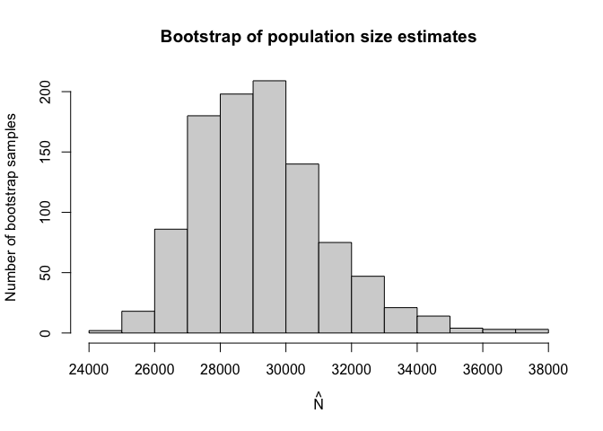

<!-- README.md is generated from README.Rmd. Please edit that file -->

# singleRcapture

<!-- badges: start -->
<!-- badges: end -->

The goal of singleRcapture is to automate single source
capture-recapture estimation of population size.

## Funding

Work on this package is supported by the the National Science Center,
OPUS 22 grant no. 2020/39/B/HS4/00941.

## Installation

You can install the development version of singleRcapture from
[GitHub](https://github.com/ncn-foreigners/singleRcapture) with:

``` r
# install.packages("devtools")
devtools::install_github("ncn-foreigners/singleRcapture")
```

### Examples

This is a basic example of zero truncated poisson model and zelterman
model with netherlands imigrant data with analytic variance:

``` r
library(singleRcapture)
ModelPo <- estimate_popsize(formula = capture ~ .,
                            data = netherlandsimmigrant,
                            pop.var = "analytic",
                            model = "ztpoisson",
                            method = "robust")
ModelZl <- estimate_popsize(formula = capture ~ .,
                            data = netherlandsimmigrant,
                            pop.var = "analytic",
                            model = "zelterman",
                            method = "robust")
summary(ModelPo)
#> estimate_popsize(formula = capture ~ ., data = netherlandsimmigrant, 
#>     model = "ztpoisson", method = "robust", pop.var = "analytic")
#> 
#> Standardised Pearson Residuals:
#>      Min.   1st Qu.    Median      Mean   3rd Qu.      Max. 
#> -0.490392 -0.486401 -0.300208  0.002051 -0.210901 13.945794 
#> 
#> Coefficients:
#>                      Estimate Std. Error z value P(>|z|)    
#> (Intercept)            -2.317      0.449   -5.16 2.5e-07 ***
#> gender                  0.397      0.163    2.44 1.5e-02   *
#> age                     0.975      0.408    2.39 1.7e-02   *
#> reason                  0.011      0.162    0.07 9.5e-01    
#> nationAsia             -1.092      0.302   -3.62 2.9e-04 ***
#> nationNorth Africa      0.190      0.194    0.98 3.3e-01    
#> nationRest of Africa   -0.911      0.301   -3.03 2.5e-03  **
#> nationSurinam          -2.337      1.014   -2.31 2.1e-02   *
#> nationTurkey           -1.675      0.603   -2.78 5.5e-03  **
#> -----------------------
#> Signif. codes:  0 '****' 0.001 '***' 0.01 '**' 0.05 '*' 0.1 '.' 1 ' '
#> 
#> AIC: 1714.896
#> BIC: 1764.747
#> Deviance: 1128.549
#> 
#> Log-likelihood: -848.4481 on 1871 Degrees of freedom 
#> Number of iterations: 8
#> -----------------------
#> Population size estimation results: 
#> Point estimate 12691.45
#> Observed proportion: 14.8% (N obs = 1880)
#> Std. Error 2809.508
#> 95% CI for the population size:
#>              lowerBound upperBound
#> Studentized    7184.917   18197.99
#> Logtransform   8430.749   19723.38
#> 95% CI for the share of observed population:
#>              lowerBound upperBound
#> Studentized   10.330814   26.16592
#> Logtransform   9.531836   22.29932
```

``` r
summary(ModelZl)
#> estimate_popsize(formula = capture ~ ., data = netherlandsimmigrant, 
#>     model = "zelterman", method = "robust", pop.var = "analytic")
#> 
#> Standardised Pearson Residuals:
#>      Min.   1st Qu.    Median      Mean   3rd Qu.      Max. 
#> -0.476526 -0.432354 -0.274793  0.001439 -0.191085  9.762261 
#> 
#> Coefficients:
#>                      Estimate Std. Error z value P(>|z|)    
#> (Intercept)            -3.359      0.525   -6.40 1.5e-10 ***
#> gender                  0.535      0.229    2.34 1.9e-02   *
#> age                     0.567      0.434    1.31 1.9e-01    
#> reason                  0.189      0.217    0.87 3.8e-01    
#> nationAsia             -1.056      0.442   -2.39 1.7e-02   *
#> nationNorth Africa      0.579      0.300    1.93 5.3e-02   .
#> nationRest of Africa   -0.664      0.419   -1.59 1.1e-01    
#> nationSurinam          -1.720      1.048   -1.64 1.0e-01    
#> nationTurkey           -1.030      0.654   -1.58 1.2e-01    
#> -----------------------
#> Signif. codes:  0 '****' 0.001 '***' 0.01 '**' 0.05 '*' 0.1 '.' 1 ' '
#> 
#> AIC: 1133.029
#> BIC: 1182.627
#> Deviance: 1115.029
#> 
#> Log-likelihood: -557.5143 on 1819 Degrees of freedom 
#> Number of iterations: 7
#> -----------------------
#> Population size estimation results: 
#> Point estimate 16188.3
#> Observed proportion: 11.6% (N obs = 1880)
#> Std. Error 3166.094
#> 95% CI for the population size:
#>              lowerBound upperBound
#> Studentized    9982.871   22393.73
#> Logtransform  11201.447   23843.06
#> 95% CI for the share of observed population:
#>              lowerBound upperBound
#> Studentized    8.395207   18.83226
#> Logtransform   7.884896   16.78355
```

Marginal frequencies and Goodness of fit test:

``` r
summary(marginalFreq(ModelPo), df = 2, dropl5 = "group")
#> Test for Goodness of fit of a regression model:
#> 
#>                  Test statistics df P(>X^2)
#> Chi-squared test           50.06  2 1.4e-11
#> G-test                     34.31  2 3.6e-08
#> 
#> --------------------------------------------------------
#> Cells with fitted frequencies of < 5 have been grouped
```

Here is a plot of marginal frequencies with matplot:

``` r
a1 <- marginalFreq(ModelPo)$table[-1]
a2 <- marginalFreq(ModelZl)$table[-1]
a3 <- table(netherlandsimmigrant$capture)
matplot(y = sqrt(cbind(a1, a2, a3)), x = 1:6, ylab = "Square root of Frequencies",
        xlab = "Counts", pch = 21:23, type = "o",
        lty = 1, col = 1:3, main = "Plot of observed and fitted marginal frequencies")
legend("topright",
       legend = c("Poisson model",
                  "Zelterman model",
                  "Observed data"),
       col = 1:3, pch = 21:23)
```


singleRcapture also includes bootstraps and models truncated at values 0
and 1 and non standard confidence levels

``` r
set.seed(123)
zotgeomBoot <- estimate_popsize(
    formula = TOTAL_SUB ~ .,
    data = farmsubmission,
    pop.var = "bootstrap",
    model = "zotgeom",
    method = "robust",
    control.pop.var = control.pop.var(B = 1000,
                                      alpha = .01)
  )
summary(zotgeomBoot)
#> estimate_popsize(formula = TOTAL_SUB ~ ., data = farmsubmission, 
#>     model = "zotgeom", method = "robust", pop.var = "bootstrap", 
#>     control.pop.var = control.pop.var(B = 1000, alpha = 0.01))
#> 
#> Standardised Pearson Residuals:
#>      Min.   1st Qu.    Median      Mean   3rd Qu.      Max. 
#> -0.953664 -0.727750 -0.426863  0.003653  0.322952 16.133747 
#> 
#> Coefficients:
#>              Estimate Std. Error z value  P(>|z|)    
#> (Intercept)    -2.608      0.298   -8.76  2.0e-18 ***
#> log_size        0.585      0.022   26.47 2.2e-154 ***
#> log_distance   -0.068      0.025   -2.66  7.7e-03  **
#> C_TYPE          0.611      0.044   13.73  6.6e-43 ***
#> -----------------------
#> Signif. codes:  0 '****' 0.001 '***' 0.01 '**' 0.05 '*' 0.1 '.' 1 ' '
#> 
#> AIC: 19483.08
#> BIC: 19509.67
#> Deviance: 23179.43
#> 
#> Log-likelihood: -9737.539 on 5692 Degrees of freedom 
#> Number of iterations: 7
#> -----------------------
#> Population size estimation results: 
#> Point estimate 29087.96
#> Observed proportion: 41.4% (N obs = 12036)
#> Bootstrap Std. Error 1982.073
#> 99% CI for the population size:
#> lowerBound upperBound 
#>   25461.63   36238.35 
#> 99% CI for the share of observed population:
#> lowerBound upperBound 
#>   33.21343   47.27113
```

``` r
plot(zotgeomBoot, plotType = "bootHist")
```


