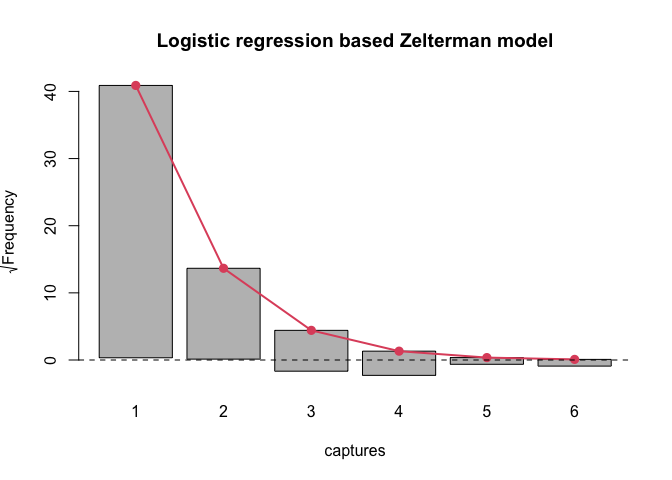

<!-- README.md is generated from README.Rmd. Please edit that file -->

# singleRcapture

<!-- badges: start -->
<!-- badges: end -->

The goal of singleRcapture is to automate single source
capture-recapture estimation of population size.

## Funding

Work on this package is supported by the the National Science Center,
OPUS 22 grant no. 2020/39/B/HS4/00941.

## Installation

You can install the development version of singleRcapture from
[GitHub](https://github.com/ncn-foreigners/singleRcapture) with:

``` r
# install.packages("devtools")
devtools::install_github("ncn-foreigners/singleRcapture")
```

### Examples

This is a basic example of zero truncated poisson model and zelterman
model with data on immigration in netherlands with analytic variance:

``` r
library(singleRcapture)
ModelPo <- estimatePopsize(formula = capture ~ .,
                            data = netherlandsimmigrant,
                            pop.var = "analytic",
                            model = "ztpoisson",
                            method = "IRLS")
#> Warning in FittingFunction(dependent = y, covariates = X, eps =
#> control$epsilon, : IRLS half-stepping terminated because the step is too small.
ModelZl <- estimatePopsize(formula = capture ~ .,
                            data = netherlandsimmigrant,
                            pop.var = "analytic",
                            model = "zelterman",
                            method = "IRLS")
#> Warning in FittingFunction(dependent = y, covariates = X, eps =
#> control$epsilon, : Convergence at halfstepsize
summary(ModelPo)
#> 
#> Call:
#> estimatePopsize(formula = capture ~ ., data = netherlandsimmigrant, 
#>     model = "ztpoisson", method = "IRLS", pop.var = "analytic")
#> 
#> Pearson Residuals:
#>      Min.   1st Qu.    Median      Mean   3rd Qu.      Max. 
#> -0.488779 -0.486085 -0.297859  0.002075 -0.210439 13.921578 
#> 
#> Coefficients:
#> -----------------------
#> For linear predictors associated with: lambda 
#>                      Estimate Std. Error z value  P(>|z|)    
#> (Intercept)          -1.33179    0.25486  -5.226 1.74e-07 ***
#> gendermale            0.39741    0.16305   2.437 0.014796 *  
#> age>40yrs            -0.97463    0.40824  -2.387 0.016969 *  
#> reasonOther reason   -0.01093    0.16153  -0.068 0.946048    
#> nationAsia           -1.09241    0.30164  -3.622 0.000293 ***
#> nationNorth Africa    0.18997    0.19400   0.979 0.327471    
#> nationRest of Africa -0.91129    0.30097  -3.028 0.002463 ** 
#> nationSurinam        -2.33665    1.01357  -2.305 0.021146 *  
#> nationTurkey         -1.67453    0.60291  -2.777 0.005479 ** 
#> ---
#> Signif. codes:  0 '***' 0.001 '**' 0.01 '*' 0.05 '.' 0.1 ' ' 1
#> 
#> AIC: 1714.896
#> BIC: 1764.747
#> Residual deviance: 1128.549
#> 
#> Log-likelihood: -848.4481 on 1871 Degrees of freedom 
#> Number of iterations: 8
#> -----------------------
#> Population size estimation results: 
#> Point estimate 12691.45
#> Observed proportion: 14.8% (N obs = 1880)
#> Std. Error 2809.505
#> 95% CI for the population size:
#>              lowerBound upperBound
#> Studentized    7184.921   18197.98
#> Logtransform   8430.750   19723.37
#> 95% CI for the share of observed population:
#>              lowerBound upperBound
#> Studentized   10.330819   26.16591
#> Logtransform   9.531842   22.29932
```

``` r
summary(ModelZl)
#> 
#> Call:
#> estimatePopsize(formula = capture ~ ., data = netherlandsimmigrant, 
#>     model = "zelterman", method = "IRLS", pop.var = "analytic")
#> 
#> Pearson Residuals:
#>     Min.  1st Qu.   Median     Mean  3rd Qu.     Max. 
#> -0.47496 -0.43206 -0.32340  0.04906 -0.19071  9.54717 
#> 
#> Coefficients:
#> -----------------------
#> For linear predictors associated with: lambda 
#>                      Estimate Std. Error z value  P(>|z|)    
#> (Intercept)           -2.6031     0.3821  -6.813 9.59e-12 ***
#> gendermale             0.5347     0.2320   2.305   0.0212 *  
#> age>40yrs             -0.5669     0.4338  -1.307   0.1913    
#> reasonOther reason    -0.1893     0.2198  -0.861   0.3890    
#> nationAsia            -1.0563     0.4476  -2.360   0.0183 *  
#> nationNorth Africa     0.5794     0.3067   1.889   0.0589 .  
#> nationRest of Africa  -0.6643     0.4249  -1.563   0.1180    
#> nationSurinam         -1.7201     1.0495  -1.639   0.1012    
#> nationTurkey          -1.0301     0.6567  -1.569   0.1168    
#> ---
#> Signif. codes:  0 '***' 0.001 '**' 0.01 '*' 0.05 '.' 0.1 ' ' 1
#> 
#> AIC: 1133.029
#> BIC: 1182.627
#> Residual deviance: 1115.029
#> 
#> Log-likelihood: -557.5143 on 1819 Degrees of freedom 
#> Number of iterations: 7
#> -----------------------
#> Population size estimation results: 
#> Point estimate 16188.3
#> Observed proportion: 11.6% (N obs = 1880)
#> Std. Error 3166.091
#> 95% CI for the population size:
#>              lowerBound upperBound
#> Studentized    9982.874   22393.72
#> Logtransform  11201.449   23843.04
#> 95% CI for the share of observed population:
#>              lowerBound upperBound
#> Studentized    8.395210   18.83225
#> Logtransform   7.884899   16.78354
```

Marginal frequencies and Goodness of fit test:

``` r
summary(marginalFreq(ModelPo), df = 2, dropl5 = "group")
#> Test for Goodness of fit of a regression model:
#> 
#>                  Test statistics df P(>X^2)
#> Chi-squared test           50.06  2 1.4e-11
#> G-test                     34.31  2 3.6e-08
#> 
#> -------------------------------------------------------------- 
#> Cells with fitted frequencies of < 5 have been grouped 
#> Names of cells used in calculating test(s) statistic: 1 2 3
```

Should goodness of fit tests prove insufficient in determining the best
model graphical comparisons may also be made. One such technique is a
rootogram and it is implemented as a part of singleR method for `plot`
function:

``` r
plot(ModelPo, plotType = "rootogram", main = "Zero Truncated Poisson model")
plot(ModelZl, plotType = "rootogram", main = "Logistic regression based Zelterman model")
```



`singleRcapture` also includes bootstraps and models truncated at values
0 and 1 and non standard confidence levels (i.e. different from usual
95%)

``` r
set.seed(123)
zotgeomBoot <- estimatePopsize(
    formula = TOTAL_SUB ~ .,
    data = farmsubmission,
    pop.var = "bootstrap",
    model = "zotgeom",
    method = "IRLS",
    controlPopVar = controlPopVar(B = 1000, alpha = .01)
)
summary(zotgeomBoot)
#> 
#> Call:
#> estimatePopsize(formula = TOTAL_SUB ~ ., data = farmsubmission, 
#>     model = "zotgeom", method = "IRLS", pop.var = "bootstrap", 
#>     controlPopVar = controlPopVar(B = 1000, alpha = 0.01))
#> 
#> Pearson Residuals:
#>      Min.   1st Qu.    Median      Mean   3rd Qu.      Max. 
#> -0.952107 -0.727540 -0.426714  0.003655  0.322783 16.127909 
#> 
#> Coefficients:
#> -----------------------
#> For linear predictors associated with: lambda 
#>              Estimate Std. Error z value P(>|z|)    
#> (Intercept)  -2.60802    0.29776  -8.759  <2e-16 ***
#> log_size      0.58498    0.02210  26.469  <2e-16 ***
#> log_distance -0.06793    0.02549  -2.665  0.0077 ** 
#> C_TYPEDairy   0.61081    0.04448  13.731  <2e-16 ***
#> ---
#> Signif. codes:  0 '***' 0.001 '**' 0.01 '*' 0.05 '.' 0.1 ' ' 1
#> 
#> AIC: 19483.08
#> BIC: 19509.67
#> Residual deviance: 23179.43
#> 
#> Log-likelihood: -9737.539 on 5692 Degrees of freedom 
#> Number of iterations: 7
#> -----------------------
#> Population size estimation results: 
#> Point estimate 29087.96
#> Observed proportion: 41.4% (N obs = 12036)
#> Boostrap sample skewness: 0.7788564
#> 0 skewness is expected for normally distributed vairable
#> 
#> Bootstrap Std. Error 1962.695
#> 99% CI for the population size:
#> lowerBound upperBound 
#>   25228.32   35576.04 
#> 99% CI for the share of observed population:
#> lowerBound upperBound 
#>   33.83176   47.70830
```

``` r
plot(zotgeomBoot, plotType = "bootHist", labels = TRUE, ylim = c(0, 425))
```


