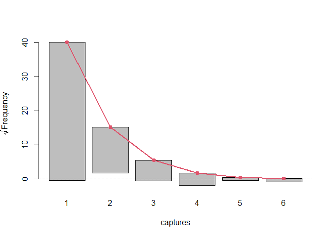
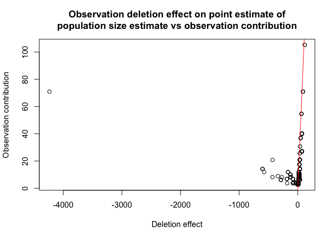
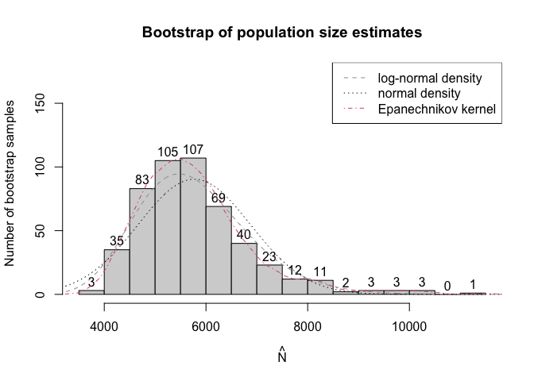

<!-- README.md is generated from README.Rmd. Please edit that file -->

# Overview

<!-- badges: start -->

[](https://github.com/ncn-foreigners/singleRcapture/actions)
[](https://app.codecov.io/gh/ncn-foreigners/singleRcapture?branch=main)
[](https://CRAN.R-project.org/package=singleRcapture)
[](https://cran.r-project.org/package=singleRcapture)
[](https://cran.r-project.org/package=singleRcapture)
[](https://doi.org/10.5281/zenodo.8436043)
<!-- badges: end -->

Capture-recapture type experiments are used to estimate the total
population size in situations when observing only a part of such
population is feasible. In recent years these types of experiments have
seen more interest.

Single source models are distinct from other capture-recapture models
because we cannot estimate the population size based on how many units
were observed in two or three sources which is the standard approach.

Instead in single source models we utilize count data regression models
on positive distributions (i.e. on counts greater than 0) where the
dependent variable is the number of times a particular unit was observed
in source data.

This package aims to implement already existing and introduce new
methods of estimating population size from single source to simplify the
research process.

Currently we have implemented most of the frequentist approaches used in
literature such as:

- Zero truncated Poisson, geometric and negative binomial regression.
- Zero truncated one inflated and one inflated zero truncated Poisson
  and geometric models. (Negative binomial is currently in development.)
- Zero one truncated Poisson geometric and negative binomial models.
- Generalized Chao’s and Zelterman’s models based on logistic
  regression.
- Three types of bootstrap parametric, semi-parametric and non
  parametric.
- And a wide range of additional functionalities associated with
  (vector) generalized linear models relevant to the topic.

## Installation

You can install the current version of singleRcapture from main branch
[GitHub](https://github.com/ncn-foreigners/singleRcapture) with:

``` r
# install.packages("devtools")
remotes::install_github("ncn-foreigners/singleRcapture")
```

or install the stable version from
[CRAN](https://cran.r-project.org/package=singleRcapture) with:

``` r
install.packages(singleRcapture)
```

### Examples

The main function of this package is `estimatePopsize` which fitts
regression on specified distribution and then uses fitted regression to
estimate the population size.

Lets look at a model from 2003 publication : Point and interval
estimation of the population size using the truncated Poisson regression
model Heijden, Peter GM van der et al. The call to `estimatePopsize`
will look very similar to anyone who used the `stats::glm` function:

``` r
library(singleRcapture)
model <- estimatePopsize(
  formula = capture ~ gender + age + nation, # specify formula
  data = netherlandsimmigrant,
  popVar = "analytic", # specify 
  model = "ztpoisson", # distribution used
  method = "IRLS", # fitting method one of three currently supported
  controlMethod = controlMethod(silent = TRUE) # ignore convergence at half step warning
)
summary(model) # a summary method for singleR class with standard glm-like output and population size estimation resutls
#> 
#> Call:
#> estimatePopsize.default(formula = capture ~ gender + age + nation, 
#>     data = netherlandsimmigrant, model = "ztpoisson", method = "IRLS", 
#>     popVar = "analytic", controlMethod = controlMethod(silent = TRUE))
#> 
#> Pearson Residuals:
#>      Min.   1st Qu.    Median      Mean   3rd Qu.      Max. 
#> -0.486442 -0.486442 -0.298080  0.002093 -0.209444 13.910844 
#> 
#> Coefficients:
#> -----------------------
#> For linear predictors associated with: lambda 
#>                      Estimate Std. Error z value  P(>|z|)    
#> (Intercept)           -1.3411     0.2149  -6.241 4.35e-10 ***
#> gendermale             0.3972     0.1630   2.436 0.014832 *  
#> age>40yrs             -0.9746     0.4082  -2.387 0.016972 *  
#> nationAsia            -1.0926     0.3016  -3.622 0.000292 ***
#> nationNorth Africa     0.1900     0.1940   0.979 0.327398    
#> nationRest of Africa  -0.9106     0.3008  -3.027 0.002468 ** 
#> nationSurinam         -2.3364     1.0136  -2.305 0.021159 *  
#> nationTurkey          -1.6754     0.6028  -2.779 0.005445 ** 
#> ---
#> Signif. codes:  0 '***' 0.001 '**' 0.01 '*' 0.05 '.' 0.1 ' ' 1
#> 
#> AIC: 1712.901
#> BIC: 1757.213
#> Residual deviance: 1128.553
#> 
#> Log-likelihood: -848.4504 on 1872 Degrees of freedom 
#> Number of iterations: 8
#> -----------------------
#> Population size estimation results: 
#> Point estimate 12690.35
#> Observed proportion: 14.8% (N obs = 1880)
#> Std. Error 2808.165
#> 95% CI for the population size:
#>           lowerBound upperBound
#> normal      7186.449   18194.25
#> logNormal   8431.277   19718.31
#> 95% CI for the share of observed population:
#>           lowerBound upperBound
#> normal     10.332933   26.16035
#> logNormal   9.534288   22.29793
```

We implemented a method for `plot` function to visualise the model fit
and other useful diagnostic information. One of which is `rootogram`, a
type of plot that compares fitted and observed marginal frequencies:

``` r
plot(model, plotType = "rootogram")
```



The possible values for `plotType` argument are:

- `qq` - the normal quantile-quantile plot for pearson residuals.
- `marginal` - a `matplot` comparing fitted and observed marginal
  frequencies.
- `fitresid` - plot of linear predictor values contrasted with pearson
  residuals.
- `bootHist` - histogram of bootstrap sample.
- `rootogram` - rootogram, example presented above.
- `dfpopContr` - contrasting two deletion effects to identify presence
  of influential observations.
- `dfpopBox` - boxplot of results from dfpopsize function see its
  documentation.
- `scaleLoc` - scale-location plot.
- `cooks` - plot of `cooks.values` for distributions for which it is
  defined.
- `hatplot` - plot of `hatvalues`.
- `strata` - plot of confidence intervals for selected such populations.

a user can also pass arguments to specify additional information such as
plot title, subtitle etc. similar to calling `plot` on some data. For
more info check `plot.singleR` method documentation.

As we have seen there are some significant differences between fitted
and observed marginal frequencies. To check our intuition let’s perform
goodness of fit test between fitted and observed marginal frequencies.

To do it we call a `summary` function of `marginalFreq` function which
computes marginal frequencies for the fitted `singleR` class object:

``` r
summary(marginalFreq(model), df = 2, dropl5 = "group")
#> Test for Goodness of fit of a regression model:
#> 
#>                  Test statistics df P(>X^2)
#> Chi-squared test           50.06  2 1.3e-11
#> G-test                     34.31  2 3.6e-08
#> 
#> -------------------------------------------------------------- 
#> Cells with fitted frequencies of < 5 have been grouped 
#> Names of cells used in calculating test(s) statistic: 1 2 3
```

Finally let us check if we have any influential observations. We will do
this by comparing the deletion effect of every observation on population
size estimate by removing it entirely from the model (from population
size estimate and regression) and by only omitting it in pop size
estimation (this is what is called the contribution of an observation).
If observation is not influential these two actions should have the
approximately the same effect:

``` r
plot(model, plotType = "dfpopContr")
```



it is easy to deduce from the plot above that we have influential
observations in our dataset (one in particular).

Lastly `singleRcapture` offers some posthoc procedures for example a
function `stratifyPopsize` that estimates sizes of user specified sub
populations and returns them in a `data.frame`:

``` r
stratifyPopsize(model, alpha = c(.01, .02, .03, .05), # different significance level for each sub population
    strata = list(
    "Females from Surinam" = netherlandsimmigrant$gender == "female" & netherlandsimmigrant$nation == "Surinam",
    "Males from Turkey" = netherlandsimmigrant$gender == "male" & netherlandsimmigrant$nation == "Turkey",
    "Younger males" = netherlandsimmigrant$gender == "male" & netherlandsimmigrant$age == "<40yrs",
    "Older males" = netherlandsimmigrant$gender == "male" & netherlandsimmigrant$age == ">40yrs"
))
#>                   name Observed Estimated ObservedPercentage  StdError
#> 1 Females from Surinam       20  931.4677           2.147149  955.0657
#> 2    Males from Turkey       78 1291.2513           6.040652  741.0066
#> 3        Younger males     1391 7337.0708          18.958520 1282.1402
#> 4          Older males       91 1542.1886           5.900705  781.4747
#>   normalLowerBound normalUpperBound logNormalLowerBound logNormalUpperBound
#> 1      -1528.61853         3391.554            119.2661            8389.158
#> 2       -432.58790         3015.090            405.4127            4573.791
#> 3       4554.71057        10119.431           5134.8122           10834.785
#> 4         10.52637         3073.851            630.7551            3992.674
#>   confLevel
#> 1      0.01
#> 2      0.02
#> 3      0.03
#> 4      0.05
```

`strata` argument may be specified in various ways for example:

``` r
stratifyPopsize(model, strata = ~ gender / age)
#>                     name Observed Estimated ObservedPercentage  StdError
#> 1         gender==female      398 3811.0911          10.443203 1153.9733
#> 2           gender==male     1482 8879.2594          16.690581 1812.0790
#> 3 genderfemale:age<40yrs      378 3169.8263          11.924944  880.9478
#> 4   gendermale:age<40yrs     1391 7337.0708          18.958520 1282.1402
#> 5 genderfemale:age>40yrs       20  641.2648           3.118836  407.5264
#> 6   gendermale:age>40yrs       91 1542.1886           5.900705  781.4747
#>   normalLowerBound normalUpperBound logNormalLowerBound logNormalUpperBound
#> 1       1549.34513         6072.837           2189.0443            6902.133
#> 2       5327.64991        12430.869           6090.7762           13354.880
#> 3       1443.20030         4896.452           1904.3126            5484.617
#> 4       4824.12208         9850.019           5306.3306           10421.082
#> 5       -157.47223         1440.002            212.3382            2026.726
#> 6         10.52637         3073.851            630.7551            3992.674
#>   confLevel
#> 1      0.05
#> 2      0.05
#> 3      0.05
#> 4      0.05
#> 5      0.05
#> 6      0.05
```

The package was designed with convenience in mind, for example it is
possible to specify that weights provided on call are to be interpreted
as number of occurrences of units in each row:

``` r
df <- netherlandsimmigrant[, c(1:3,5)]
df$ww <- 0
### this is dplyr::count without dependencies
df <- aggregate(ww ~ ., df, FUN = length)
summary(estimatePopsize(
  formula = capture ~ nation + age + gender, 
  data = df, 
  model = ztpoisson, 
  weights = df$ww,
  controlModel = controlModel(weightsAsCounts = TRUE)
))
#> 
#> Call:
#> estimatePopsize.default(formula = capture ~ nation + age + gender, 
#>     data = df, model = ztpoisson, weights = df$ww, controlModel = controlModel(weightsAsCounts = TRUE))
#> 
#> Pearson Residuals:
#>      Min.   1st Qu.    Median      Mean   3rd Qu.      Max. 
#> -317.6467   -2.4060    3.7702    0.0803   13.4920  183.2108 
#> 
#> Coefficients:
#> -----------------------
#> For linear predictors associated with: lambda 
#>                      Estimate Std. Error z value  P(>|z|)    
#> (Intercept)           -1.3411     0.2149  -6.241 4.35e-10 ***
#> nationAsia            -1.0926     0.3016  -3.622 0.000292 ***
#> nationNorth Africa     0.1900     0.1940   0.979 0.327398    
#> nationRest of Africa  -0.9106     0.3008  -3.027 0.002468 ** 
#> nationSurinam         -2.3364     1.0136  -2.305 0.021159 *  
#> nationTurkey          -1.6754     0.6028  -2.779 0.005445 ** 
#> age>40yrs             -0.9746     0.4082  -2.387 0.016972 *  
#> gendermale             0.3972     0.1630   2.436 0.014832 *  
#> ---
#> Signif. codes:  0 '***' 0.001 '**' 0.01 '*' 0.05 '.' 0.1 ' ' 1
#> 
#> AIC: 1712.901
#> BIC: 1757.213
#> Residual deviance: 1128.553
#> 
#> Log-likelihood: -848.4504 on 1872 Degrees of freedom 
#> Number of iterations: 8
#> -----------------------
#> Population size estimation results: 
#> Point estimate 12690.35
#> Observed proportion: 14.8% (N obs = 1880)
#> Std. Error 2808.169
#> 95% CI for the population size:
#>           lowerBound upperBound
#> normal      7186.444   18194.26
#> logNormal   8431.275   19718.32
#> 95% CI for the share of observed population:
#>           lowerBound upperBound
#> normal     10.332927   26.16037
#> logNormal   9.534281   22.29793
```

Methods such as regression diagnostics will be adjusted (values of
weights will be reduced instead of rows being removed etc.)

We also included option to use common non standardargument such as
significance levels different from usual 5%:

``` r
set.seed(123)
modelInflated <- estimatePopsize(
    formula = capture ~ gender + age,
    data = netherlandsimmigrant,
    model = "oiztgeom",
    method = "IRLS",
    # control parameters for population size estimation check documentation of controlPopVar
    controlPopVar = controlPopVar(
        alpha = .01, # significance level 
    )
)
summary(modelInflated)
#> 
#> Call:
#> estimatePopsize.default(formula = capture ~ gender + age, data = netherlandsimmigrant, 
#>     model = "oiztgeom", method = "IRLS", controlPopVar = controlPopVar(alpha = 0.01, 
#>         ))
#> 
#> Pearson Residuals:
#>      Min.   1st Qu.    Median      Mean   3rd Qu.      Max. 
#> -0.357193 -0.357193 -0.357193  0.000343 -0.287637 10.233608 
#> 
#> Coefficients:
#> -----------------------
#> For linear predictors associated with: lambda 
#>             Estimate Std. Error z value P(>|z|)    
#> (Intercept)  -1.5346     0.1846  -8.312 < 2e-16 ***
#> gendermale    0.3863     0.1380   2.800 0.00512 ** 
#> age>40yrs    -0.7788     0.2942  -2.648 0.00810 ** 
#> -----------------------
#> For linear predictors associated with: omega 
#>             Estimate Std. Error z value  P(>|z|)    
#> (Intercept)  -1.7591     0.3765  -4.673 2.97e-06 ***
#> ---
#> Signif. codes:  0 '***' 0.001 '**' 0.01 '*' 0.05 '.' 0.1 ' ' 1
#> 
#> AIC: 1736.854
#> BIC: 1759.01
#> Residual deviance: 1011.271
#> 
#> Log-likelihood: -864.4272 on 3756 Degrees of freedom 
#> Number of iterations: 6
#> -----------------------
#> Population size estimation results: 
#> Point estimate 5661.522
#> Observed proportion: 33.2% (N obs = 1880)
#> Std. Error 963.9024
#> 99% CI for the population size:
#>           lowerBound upperBound
#> normal      3178.674   8144.370
#> logNormal   3861.508   9096.681
#> 99% CI for the share of observed population:
#>           lowerBound upperBound
#> normal      23.08343   59.14416
#> logNormal   20.66688   48.68564
```

and the option to estimate standard error of population size estimate by
bootstrap, models with more than one distribution parameter being
dependent on covariates and some non standard link functions for
example:

``` r
modelInflated2 <- estimatePopsize(
    formula = capture ~ age,
    data = netherlandsimmigrant,
    popVar = "bootstrap",
    model = oiztgeom(omegaLink = "cloglog"),
    method = "IRLS",
    controlPopVar = controlPopVar(
        B = 500,# number of boostrap samples
        alpha = .01, # significance level 
        # type of bootstrap see documentation for estimatePopsize
        bootType = "semiparametric",
        # control regression fitting on bootstrap samples
        bootstrapFitcontrol = controlMethod(
          epsilon = .Machine$double.eps, 
          silent = TRUE, 
          stepsize = 2
        )
    ),
    controlModel = controlModel(omegaFormula = ~ gender) # put covariates on omega i.e. the inflation parameter
)
#> Warning in estimatePopsize.default(formula = capture ~ age, data = netherlandsimmigrant, : The (analytically computed) hessian of the score function is not negative define.
#> NOTE: Second derivative test failing does not 
#>         necessarily mean that the maximum of score function that was found 
#>         numericaly is invalid since R^k is not a bounded space.
#> Additionally in one inflated and hurdle models second derivative test often fails even on valid arguments.
#> Warning in estimatePopsize.default(formula = capture ~ age, data =
#> netherlandsimmigrant, : Switching from observed information matrix to Fisher
#> information matrix because hessian of log-likelihood is not negative define.
popSizeEst(modelInflated2)
#> Point estimate: 5496.376
#> Variance: 1217986
#> 99% confidence intervals:
#> lowerBound upperBound 
#>   4002.763  10231.716
```

the results are significantly different (the warning issued concerns the
second derivative test for existence of local minimum, here it was
inconclusive but we manually checked that fitting process found the
optimal regression coefficients it’s here to provide more information to
the user):

``` r
plot(modelInflated2, 
     plotType = "bootHist", 
     labels = TRUE, 
     ylim = c(0, 175),
     breaks = 15)
```



and information criteria support the second model:

    #>  First model: AIC = 1736.854 BIC = 1759.01
    #> Second model: AIC = 1734.803 BIC = 1756.959

## Funding

Work on this package is supported by the the National Science Centre,
OPUS 20 grant no. 2020/39/B/HS4/00941.
