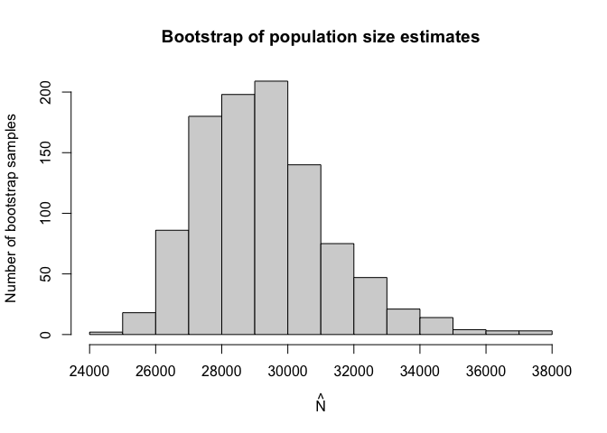

<!-- README.md is generated from README.Rmd. Please edit that file -->

# Overview

<!-- badges: start -->

[](https://github.com/ncn-foreigners/singleRcapture/actions)
<!-- badges: end -->

Capture-recapture type experiments are used to estimate the total
population size in situations when observing only a part of such
population is feasible. In recent years these types of experiments have
seen more interest.

Single source models are distinct from other capture-recapture models
because we cannot estimate the population size based on how many units
were observed in two or three sources which is the standard approach.

Instead in single source models we utilise count data regression models
on positive distributions (i.e. on counts greater than 0) where the
dependent variable is the number of times a particular unit was observed
in source data.

This package aims to implement already existing and introduce new
methods of estimating population size from single source to simplify the
research process.

Currently we’ve implemented most of the frequentist approaches used in
literature such as:

-   Zero truncated poisson, geometric and negative binomial regression.
-   Zero truncated one inflated and one inflated zero truncated poisson
    and gemetric models. (Negative binomial is currently in
    development.)
-   Zero one truncated poisson geometric and negative binomial models.
-   Generalised Chao and Zelterman’s models based on logistic
    regression.
-   Three types of bootstrap parametric, semi-parametric and non
    parametric.
-   And a wide range of additional functionalities associated with
    (vector) generalised linear models relevant to the topic.

## Installation

You can install the development version of singleRcapture from
[GitHub](https://github.com/ncn-foreigners/singleRcapture) with:

``` r
# install.packages("devtools")
remotes::install_github("ncn-foreigners/singleRcapture")
```

### Examples

The main function of this package is `estimatePopsize` which fitts
regression on specified distribution and then uses fitted regression to
estimate the population size.

Lets look at a model from 2003 publication : Point and interval
estimation of the population size using the truncated Poisson regression
model Heijden, Peter GM van der et al. The call to `estimatePopsize`
will look very simmilar to anyone who used the `stats::glm` function:

``` r
library(singleRcapture)
model <- estimatePopsize(
  formula = capture ~ gender + age + nation + reason, # specify formula
  data = netherlandsimmigrant,
  popVar = "analytic", # specify 
  model = "ztpoisson", # distribution used
  method = "IRLS" # fitting method one of three currently supported
)
summary(model) # a summary method for singleR class with standard glm-like output and population size estimation resutls
#> 
#> Call:
#> estimatePopsize(formula = capture ~ gender + age + nation + reason, 
#>     data = netherlandsimmigrant, model = "ztpoisson", method = "IRLS", 
#>     popVar = "analytic")
#> 
#> Pearson Residuals:
#>      Min.   1st Qu.    Median      Mean   3rd Qu.      Max. 
#> -0.488779 -0.486085 -0.297859  0.002075 -0.210439 13.921578 
#> 
#> Coefficients:
#> -----------------------
#> For linear predictors associated with: lambda 
#>                      Estimate Std. Error z value  P(>|z|)    
#> (Intercept)          -1.33179    0.25486  -5.226 1.74e-07 ***
#> gendermale            0.39741    0.16305   2.437 0.014796 *  
#> age>40yrs            -0.97463    0.40824  -2.387 0.016969 *  
#> nationAsia           -1.09241    0.30164  -3.622 0.000293 ***
#> nationNorth Africa    0.18997    0.19400   0.979 0.327471    
#> nationRest of Africa -0.91129    0.30097  -3.028 0.002463 ** 
#> nationSurinam        -2.33665    1.01357  -2.305 0.021146 *  
#> nationTurkey         -1.67453    0.60291  -2.777 0.005479 ** 
#> reasonOther reason   -0.01093    0.16153  -0.068 0.946048    
#> ---
#> Signif. codes:  0 '***' 0.001 '**' 0.01 '*' 0.05 '.' 0.1 ' ' 1
#> 
#> AIC: 1714.896
#> BIC: 1764.747
#> Residual deviance: 1128.549
#> 
#> Log-likelihood: -848.4481 on 1871 Degrees of freedom 
#> Number of iterations: 8
#> -----------------------
#> Population size estimation results: 
#> Point estimate 12691.45
#> Observed proportion: 14.8% (N obs = 1880)
#> Std. Error 2809.508
#> 95% CI for the population size:
#>              lowerBound upperBound
#> Studentized    7184.917   18197.99
#> Logtransform   8430.749   19723.38
#> 95% CI for the share of observed population:
#>              lowerBound upperBound
#> Studentized   10.330814   26.16592
#> Logtransform   9.531836   22.29932
```

We implemented a method for `plot` function to visualise the model fit
and other usefull diagnostic information. One of which is `rootogram`, a
type of plot that compares fitted and observed marginal frequencies:

``` r
plot(model, plotType = "rootogram")
```


The possible values for `plotType` argument are:

-   `QQ` - the normal quantile-quantile plot for pearson residuals.
-   `marginal` - a `matplot` comparing fitted and observed marginal
    frequencies.
-   `fitresid` - plot of linear predictor values contrasted with pearson
    residuals.
-   `bootHist` - histogram of bootstrap sample.
-   `rootogram` - rootogram, example presented above.
-   `dfpopContr` - contrasting two deletion effects to identify presence
    of influential observations.
-   `dfpopBox` - boxplot of results from dfpopsize function see its
    documentation.
-   `scaleLoc` - scale-location plot.
-   `Cooks` - plot of `cooks.values` for distributions for which it is
    defined.
-   `hatplot` - plot of `hatvalues`.

a user can also pass arguments to specify additional information such as
plot title, subtitle etc. similar to calling `plot` on some data. For
more info check `plot.singleR` method documentation.

As we have seen there are some significant differences between fitted
and observed marginal frequencies. To check our intuition let’s perform
goodness of fit test between fitted and observed marginal frequencies.

To do it we call a `summary` function of `marginalFreq` function which
computes marginal frequencies for the fitted `singleR` class object:

``` r
summary(marginalFreq(model), df = 2, dropl5 = "group")
#> Test for Goodness of fit of a regression model:
#> 
#>                  Test statistics df P(>X^2)
#> Chi-squared test           50.06  2 1.4e-11
#> G-test                     34.31  2 3.6e-08
#> 
#> -------------------------------------------------------------- 
#> Cells with fitted frequencies of < 5 have been grouped 
#> Names of cells used in calculating test(s) statistic: 1 2 3
```

Finally let us check if we have any influential observations. We will do
this by comparing the deletion effect of every observation on population
size estimate by removing it entirely from the model (from population
size estimate and regression) and by only omitting it in pop size
estimation (this is what is called the contribution of an observation).
If observation is not influential these two actions should have the
approximately the same effect:

``` r
plot(model, plotType = "dfpopContr")
```


it is easy to deduce from the plot above that we have influential
observations in our dataset (one in particular).

Lastly `singleRcapture` offers some posthoc procedures for example a
function `stratifyPopEst` that estimates sizes of user specified sub
populations and returns them in a `data.frame`:

``` r
stratifyPopEst(model, alpha = c(.01, .02, .03, .05), # different significance level for each sub population
    stratas = list(
    "Females from Surinam" = netherlandsimmigrant$gender == "female" & netherlandsimmigrant$nation == "Surinam",
    "Males from Turkey" = netherlandsimmigrant$gender == "male" & netherlandsimmigrant$nation == "Turkey",
    "Younger males" = netherlandsimmigrant$gender == "male" & netherlandsimmigrant$age == "<40yrs",
    "Older males" = netherlandsimmigrant$gender == "male" & netherlandsimmigrant$age == ">40yrs"
))
#>                      Observed Estimated ObservedProcentage  StdError
#> Females from Surinam       20   932.371           2.145069  956.1229
#> Males from Turkey          78  1291.514           6.039425  741.1843
#> Younger males            1391  7337.175          18.958251 1281.9295
#> Older males                91  1542.882           5.898055  782.2326
#>                      Studentized - LowerBounds% Studentized - UpperBounds%
#> Females from Surinam               -1530.438420                   3395.180
#> Males from Turkey                   -432.738939                   3015.766
#> Younger males                       4555.271881                  10119.078
#> Older males                            9.733753                   3076.029
#>                      Chao - LowerBounds% Chao - UpperBounds%
#> Females from Surinam            119.3464            8398.972
#> Males from Turkey               405.4748            4574.882
#> Younger males                  5135.1856           10834.174
#> Older males                     630.7808            3996.215
```

`stratas` argument may be specified in various ways for example:

``` r
stratifyPopEst(model, stratas = ~ gender / age)
#>                        Observed Estimated ObservedProcentage  StdError
#> gender==female              398 3811.3954          10.442370 1154.7825
#> gender==male               1482 8880.0563          16.689083 1812.6286
#> genderfemale:age<40yrs      378 3169.5475          11.925992  881.2932
#> gendermale:age<40yrs       1391 7337.1748          18.958251 1281.9295
#> genderfemale:age>40yrs       20  641.8478           3.116003  408.1451
#> gendermale:age>40yrs         91 1542.8815           5.898055  782.2326
#>                        Studentized - 2.5% Studentized - 97.5% Chao - 2.5%
#> gender==female                1548.063241            6074.727   2188.5341
#> gender==male                  5327.369600           12432.743   6090.8584
#> genderfemale:age<40yrs        1442.244687            4896.850   1903.7278
#> gendermale:age<40yrs          4824.639108            9849.710   5306.6899
#> genderfemale:age>40yrs        -158.101825            1441.797    212.4088
#> gendermale:age>40yrs             9.733753            3076.029    630.7808
#>                        Chao - 97.5%
#> gender==female             6905.147
#> gender==male              13357.226
#> genderfemale:age<40yrs     5485.554
#> gendermale:age<40yrs      10420.570
#> genderfemale:age>40yrs     2029.756
#> gendermale:age>40yrs       3996.215
```

`singleRcapture` package also includes the option to estimate standard
error of population size estimate by bootstrap and common non standard
argument such as significance levels different from usual 5%:

``` r
set.seed(123)
modelInflated <- estimatePopsize(
    formula = capture ~ nation + gender + age,
    data = netherlandsimmigrant,
    popVar = "bootstrap",
    model = "oiztgeom",
    method = "IRLS",
    controlMethod = controlMethod(stepsize = .2), # control parameters for regression fitting check doccumentation of controlMethod
    controlPopVar = controlPopVar( # control parameters for population size estimation check doccumentation of controlPopVar
        B = 1250, # number of boostrap samples
        alpha = .01, # significance level 
        bootType = "semiparametric" # type of bootstrap see doccumentation for estimatePopsize
    )
)
summary(modelInflated)
#> 
#> Call:
#> estimatePopsize(formula = capture ~ nation + gender + age, data = netherlandsimmigrant, 
#>     model = "oiztgeom", method = "IRLS", popVar = "bootstrap", 
#>     controlMethod = controlMethod(stepsize = 0.2), controlPopVar = controlPopVar(B = 1250, 
#>         alpha = 0.01, bootType = "semiparametric"))
#> 
#> Pearson Residuals:
#>      Min.   1st Qu.    Median      Mean   3rd Qu.      Max. 
#> -0.416300 -0.416300 -0.292541  0.004086 -0.188313 13.733512 
#> 
#> Coefficients:
#> -----------------------
#> For linear predictors associated with: lambda 
#>                      Estimate Std. Error z value  P(>|z|)    
#> (Intercept)           -1.5518     0.2395  -6.480 9.19e-11 ***
#> nationAsia            -0.8294     0.2573  -3.224  0.00126 ** 
#> nationNorth Africa     0.2082     0.1854   1.123  0.26147    
#> nationRest of Africa  -0.6800     0.2578  -2.638  0.00834 ** 
#> nationSurinam         -1.5370     0.6403  -2.401  0.01637 *  
#> nationTurkey          -1.1880     0.4336  -2.740  0.00614 ** 
#> gendermale             0.3145     0.1466   2.145  0.03194 *  
#> age>40yrs             -0.6692     0.3116  -2.148  0.03171 *  
#> -----------------------
#> For linear predictors associated with: omega 
#>             Estimate Std. Error z value  P(>|z|)    
#> (Intercept)  -2.2241     0.4556  -4.882 1.05e-06 ***
#> ---
#> Signif. codes:  0 '***' 0.001 '**' 0.01 '*' 0.05 '.' 0.1 ' ' 1
#> 
#> AIC: 1676.961
#> BIC: 1726.813
#> Residual deviance: 941.3779
#> 
#> Log-likelihood: -829.4807 on 3751 Degrees of freedom 
#> Number of iterations: 52
#> -----------------------
#> Population size estimation results: 
#> Point estimate 7559.606
#> Observed proportion: 24.9% (N obs = 1880)
#> Boostrap sample skewness: 0.3109832
#> 0 skewness is expected for normally distributed vairable
#> ---
#> Bootstrap Std. Error 3194.534
#> 99% CI for the population size:
#> lowerBound upperBound 
#>   4517.296  18967.029 
#> 99% CI for the share of observed population:
#> lowerBound upperBound 
#>   9.911937  41.617818
```

``` r
plot(modelInflated, plotType = "bootHist", labels = TRUE, ylim = c(0, 300))
```



## Funding

Work on this package is supported by the the National Science Center,
OPUS 22 grant no. 2020/39/B/HS4/00941.
